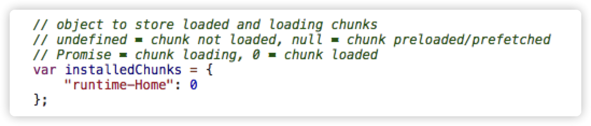
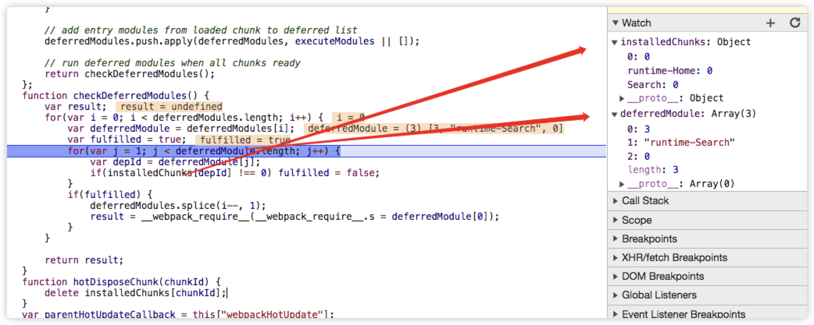
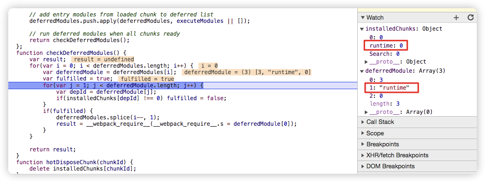

# 基于create-react-app的多页面打包方案
> 基于 3.4.1 版本的 create-react-app，webpack 的版本为 4.42.0，webpack-dev-server 的版本为 3.10.3

## 原理
每个⻚⾯对应⼀个 entry，⼀个 html-webpack-plugin，例如：

```javascript
  module.exports = {
    // ...
    entry: {
      index: './src/pages/index.js',
      search: './src/pages/search.js',
      // ...
    },
    plugins: [
      new HtmlWebpackPlugin({
        template: path.join(__dirname, './src/pages/index.html')
        filename: 'index.html',
        inject: true,
        minify: {
            html5: true,
            collapseWhitespace: true,
            preserveLineBreaks: false,
            minifyCSS: true,
            minifyJS: true,
            removeComments: false
        }
      }),
      new HtmlWebpackPlugin({
        template: path.join(__dirname, './src/pages/search.html')
        filename: 'search.html',
        inject: true,
        minify: {
            html5: true,
            collapseWhitespace: true,
            preserveLineBreaks: false,
            minifyCSS: true,
            minifyJS: true,
            removeComments: false
        }
      })
    ]
    // ...
  }
```

> 缺点：每次新增或删除⻚⾯需要改 webpack 配置

为了解决上述的缺点，我们应该制定一点套规则，然后动态的生成 entry 和 HtmlWebpackPlugin


## 改造react-react-app脚手架
> 基于 3.4.1 版本的 create-react-app，webpack 的版本为 4.42.0，webpack-dev-server 的版本为 3.10.3

#### 1. 修改 entry
```javascript
  entry: {
    Home: [
      isEnvDevelopment &&
        require.resolve('react-dev-utils/webpackHotDevClient'),
      './src/pages/Home/index.js',
      // We include the app code last so that if there is a runtime error during
      // initialization, it doesn't blow up the WebpackDevServer client, and
      // changing JS code would still trigger a refresh.
    ].filter(Boolean),
    Search: [
      isEnvDevelopment &&
        require.resolve('react-dev-utils/webpackHotDevClient'),
      './src/pages/Search/index.js',
      // We include the app code last so that if there is a runtime error during
      // initialization, it doesn't blow up the WebpackDevServer client, and
      // changing JS code would still trigger a refresh.
    ].filter(Boolean),
  }
```

#### 2. 修改 output
```javascript
  // 查看脚手架生成的 output，一般来说不需要修改
  output: {
    // The build folder.
    path: isEnvProduction ? paths.appBuild : undefined,
    // Add /* filename */ comments to generated require()s in the output.
    pathinfo: isEnvDevelopment,
    // There will be one main bundle, and one file per asynchronous chunk.
    // In development, it does not produce real files.
    filename: isEnvProduction
      ? 'static/js/[name].[contenthash:8].js'
      : isEnvDevelopment && 'static/js/bundle.js',
    // TODO: remove this when upgrading to webpack 5
    futureEmitAssets: true,
    // There are also additional JS chunk files if you use code splitting.
    chunkFilename: isEnvProduction
      ? 'static/js/[name].[contenthash:8].chunk.js'
      : isEnvDevelopment && 'static/js/[name].chunk.js',
    // webpack uses `publicPath` to determine where the app is being served from.
    // It requires a trailing slash, or the file assets will get an incorrect path.
    // We inferred the "public path" (such as / or /my-project) from homepage.
    publicPath: paths.publicUrlOrPath,
    // Point sourcemap entries to original disk location (format as URL on Windows)
    devtoolModuleFilenameTemplate: isEnvProduction
      ? info =>
          path
            .relative(paths.appSrc, info.absoluteResourcePath)
            .replace(/\\/g, '/')
      : isEnvDevelopment &&
        (info => path.resolve(info.absoluteResourcePath).replace(/\\/g, '/')),
    // Prevents conflicts when multiple webpack runtimes (from different apps)
    // are used on the same page.
    jsonpFunction: `webpackJsonp${appPackageJson.name}`,
    // this defaults to 'window', but by setting it to 'this' then
    // module chunks which are built will work in web workers as well.
    globalObject: 'this',
  },
```

#### 3. 修改 HtmlWebpackPlugin 插件
```javascript
  new HtmlWebpackPlugin(
    Object.assign(
      {},
      {
        inject: true,
        filename: 'Home.html', // 新增
        template: './src/pages/Home/index.html', // 更改
        chunks: ['Home'] // 新增
      },
      isEnvProduction
        ? {
            minify: {
              removeComments: true,
              collapseWhitespace: true,
              removeRedundantAttributes: true,
              useShortDoctype: true,
              removeEmptyAttributes: true,
              removeStyleLinkTypeAttributes: true,
              keepClosingSlash: true,
              minifyJS: true,
              minifyCSS: true,
              minifyURLs: true,
            },
          }
        : undefined
    )
  ),
  new HtmlWebpackPlugin(
    Object.assign(
      {},
      {
        inject: true,
        filename: 'Search.html', // 新增
        template: './src/pages/Search/index.html',// 更改
        chunks: ['Search'] // 新增
      },
      isEnvProduction
        ? {
            minify: {
              removeComments: true,
              collapseWhitespace: true,
              removeRedundantAttributes: true,
              useShortDoctype: true,
              removeEmptyAttributes: true,
              removeStyleLinkTypeAttributes: true,
              keepClosingSlash: true,
              minifyJS: true,
              minifyCSS: true,
              minifyURLs: true,
            },
          }
        : undefined
    )
  ),
```

#### 4. ManifestPlugin 插件打包报错
```javascript
  // 原因是 entrypoints.main.filter 其中由于第一步更改 entry，导致 entrypoints.main 为 undefined

  const entrypointFiles = {};
  Object.keys(entrypoints).forEach(entrypoint => {
      entrypointFiles[entrypoint] = entrypoints[entrypoint].filter(fileName => !fileName.endsWith('.map'));
  });
```

!> 此时，yarn build 打包的文件没有任何问题，但是 yarn start 只能访问其中的一个html文件(通常是第一个HtmlWebpackPlugin)，访问其他的页面是空白的。
经测试发现，非空白的html文件，在拿到对应的 chunk.js 之后，会调用 ws://localhost:3000/sockjs-node，而访问空的html则没有，因此判断是 webpackDevServer 除了问题

#### 5. 解决 DevServer 多页应用访问空白问题
先说解决办法，修改 webpack 中 optimization 的 runtimeChunk

```javascript
  runtimeChunk: {
    // name: entrypoint => `runtime-${entrypoint.name}`,
    name: 'runtime'
  }
```

##### 原因：
1. `runtime-${entrypoint.name}` 的写法会导致 webpack 的 bootstrap 文件中的 installedChunks 初始值如下图


2. webpack 的 bootstrap 文件中checkDeferredModules 会根据installedChunks的初始值来决定是否延迟加载对应的模块，当加载非 Home(自定义的名称)的页面时，如图中 Search，此时由于 installedChunks 初始化中只有runtime-Home，而无 runtime-Search，导致不会执行函数尾部的 _webpack_require去加载对应的模块


3. 当设置 runtimeChunk 的 name: 'runtime'时，结果如下


此时不会在收到你加载是 Home 模块，还是 Search 模块的影响
